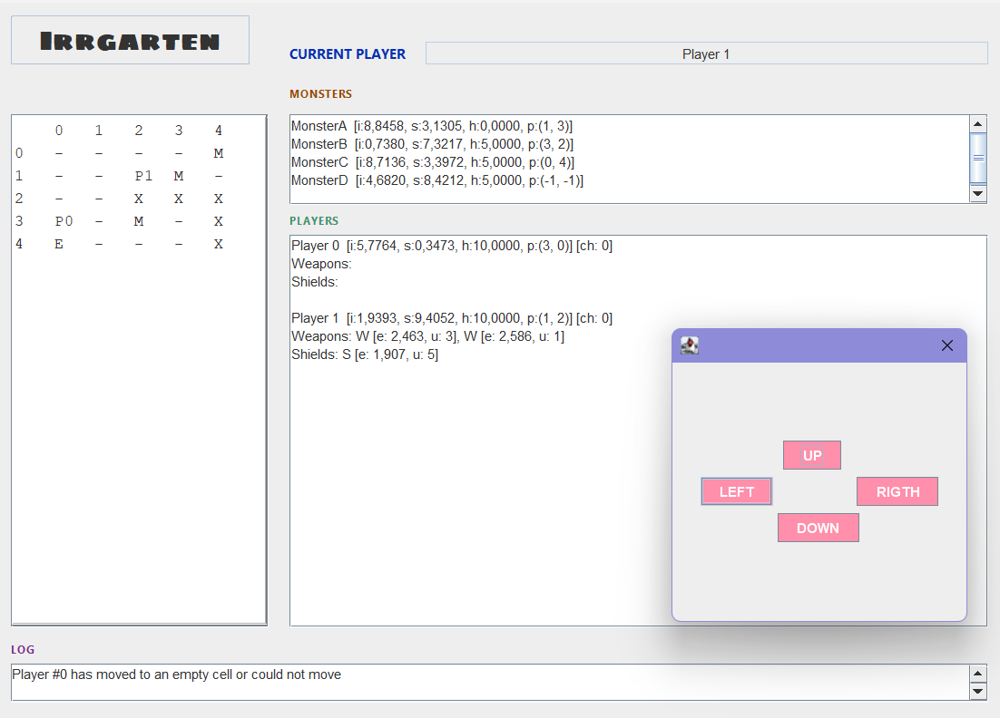

# Irrgarten

**Development period:** September – December 2025  
**Course:** Object-Oriented Programming and Design (PDOO)  
**University:** University of Granada  
**Language:** Java  
**IDE:** NetBeans  

Irrgarten is an academic object-oriented programming project developed progressively throughout the Object-Oriented Programming and Design course at the University of Granada.

The project implements a labyrinth-based game in which several players must navigate a board, confront monsters and reach the exit before the other players.

Its main purpose was to apply object-oriented software development concepts to a complete application, evolving the system across several iterations from basic domain classes to a graphical application structured according to the Model-View-Controller pattern.

## Gameplay



At the beginning of the game, players are placed randomly inside a labyrinth containing walls, monsters and an exit.

During each turn, a player attempts to move to an adjacent cell. If the destination contains a monster, a combat starts automatically.

Players have attributes such as:

- Strength
- Intelligence
- Health
- Weapons
- Shields

Weapons increase attack power and shields increase defensive capabilities, although both have a limited number of uses.

Winning combats can reward players with new weapons, shields and health. Players can also die and potentially be resurrected during subsequent turns.

The game finishes when one of the players reaches the exit of the labyrinth.

## Object-Oriented Design

The project was developed incrementally, applying increasingly advanced object-oriented programming concepts.

### Domain modelling

The core game logic is divided among classes with specific responsibilities, including:

- `Game` — manages the overall game flow, turns, combat and game state.
- `Labyrinth` — represents the board and manages players, monsters, obstacles and movement.
- `Player` — models the state and behaviour of a player.
- `Monster` — represents enemies encountered inside the labyrinth.
- `Weapon` — models offensive combat elements.
- `Shield` — models defensive combat elements.
- `Dice` — centralizes the random decisions and probabilities used by the game.
- `GameState` — provides a representation of the complete state of a game.

The implementation follows the separation of responsibilities defined by the project's class design, aiming for high cohesion and low coupling between components.

### Inheritance and polymorphism

The design was later refactored to introduce inheritance and polymorphism.

`LabyrinthCharacter` acts as an abstract superclass for the different characters in the game:

- `Player`
- `Monster`

Similarly, common behaviour shared by weapons and shields is generalized through the abstract `CombatElement` class.

The project also introduces `FuzzyPlayer`, a specialized type of player whose movement, attack and defensive behaviour incorporates probabilistic decisions.

These changes allowed the project to work with different object types through common abstractions and dynamic method dispatch.

### Generic programming

The Java implementation uses a generic `CardDeck` abstraction to manage decks containing combat elements.

Specialized decks are implemented for:

- Weapons
- Shields

This provided practical experience with Java generics and bounded type parameters while avoiding duplicated behaviour between similar collections.

## Model-View-Controller

The application follows the **Model-View-Controller (MVC)** architectural pattern.

The model contains the complete game logic, while the controller coordinates the interaction between the model and the user interface.

A common `UI` interface defines the operations required by the controller, allowing different user interfaces to interact with the same game logic.

Two interfaces were implemented:

### Text interface

`TextUI` provides a console-based version of the game where the player can inspect the game state and enter movement instructions.

### Graphical interface

A graphical interface was later implemented using **Java Swing**.

`GraphicUI` displays information about:

- The labyrinth
- Players
- Monsters
- Current player
- Game events
- Winner state

Player movement is selected through a modal `Cursors` dialog implemented using `JDialog`.

Because both graphical and text interfaces implement the same `UI` abstraction, the controller can operate independently from the specific presentation layer.

## Project evolution

The project was developed progressively throughout several practical assignments:

1. **Object-oriented fundamentals**
   - Classes and objects
   - Encapsulation
   - Enumerated types
   - Randomized game behaviour
   - Initial testing programs

2. **Structural design implementation**
   - Implementation of the complete class structure
   - Relationships between objects
   - Collections and two-dimensional board structures
   - Game, labyrinth, player and monster modelling

3. **Dynamic behaviour**
   - Implementation from sequence diagrams
   - Complete game mechanics
   - Combat and movement logic
   - Console user interface
   - Controller integration
   - Debugging and targeted testing

4. **Inheritance and polymorphism**
   - Abstract classes
   - Method overriding
   - Dynamic binding
   - `FuzzyPlayer`
   - Generic card decks

5. **Graphical interface and MVC**
   - Common UI abstraction
   - Java Swing interface
   - `JFrame` and `JDialog`
   - Separation between model, view and controller

## Project structure

```text
Irrgarten/
├── src/
│   └── irrgarten/
│       ├── controller/
│       │   └── Controller.java
│       │
│       ├── main/
│       │   └── main.java
│       │
│       ├── UI/
│       │   ├── UI.java
│       │   ├── TextUI.java
│       │   ├── GraphicUI.java
│       │   └── Cursors.java
│       │
│       ├── CardDeck.java
│       ├── CombatElement.java
│       ├── Dice.java
│       ├── Directions.java
│       ├── FuzzyPlayer.java
│       ├── Game.java
│       ├── GameState.java
│       ├── Labyrinth.java
│       ├── LabyrinthCharacter.java
│       ├── Monster.java
│       ├── Player.java
│       ├── Shield.java
│       ├── ShieldCardDeck.java
│       ├── Weapon.java
│       └── WeaponCardDeck.java
│
├── nbproject/
├── build.xml
└── manifest.mf
```

## Academic context  

The project was developed from specifications, UML class diagrams and sequence diagrams provided throughout the course.

My work consisted of translating those designs into a complete Java implementation, developing the game logic, applying inheritance and polymorphism, implementing generic components and integrating both text and graphical user interfaces.
